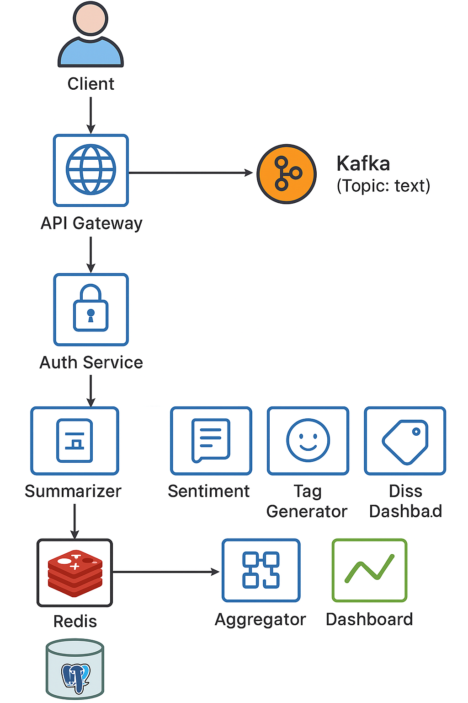

# AI-Powered Microservices Platform

A distributed microservices architecture for intelligent text processing with FastAPI, Kafka, and AI services.

---

## 🧭 System Architecture

This diagram illustrates the flow of data through the AI-powered microservices platform.

---

## 📌 Features

- Kafka-based message queue
- Microservices for summarization, sentiment analysis, tagging
- Modular FastAPI services
- JWT authentication (coming soon)
- CI/CD, Docker, Monitoring (planned)

## 📄 Project Documentation

📄 [Full Specification](./docs/product-spec.md)

## 🚀 Status

✅ Core structure ready  
🛠️ Kafka integration in progress  
📦 More services to come
